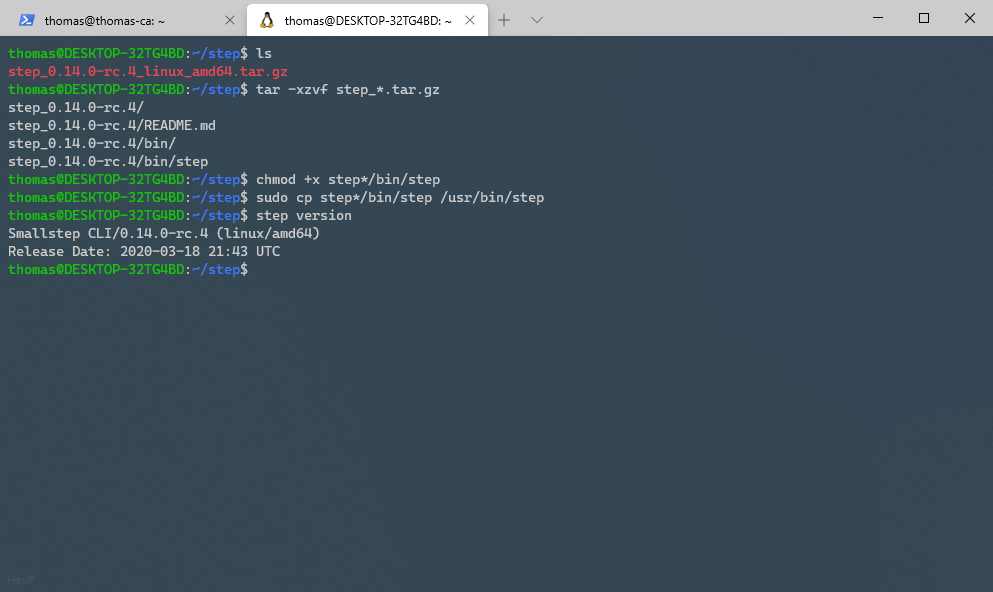
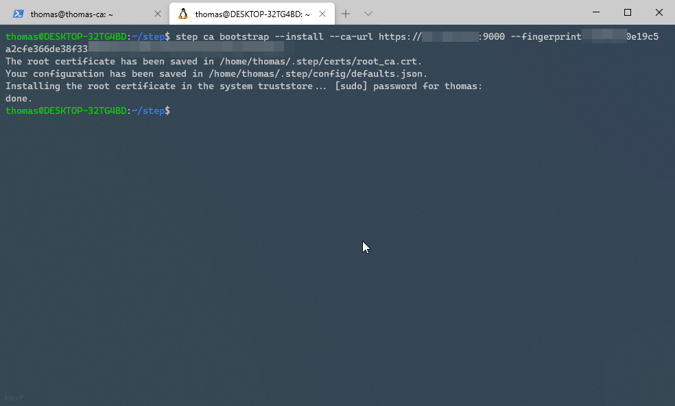
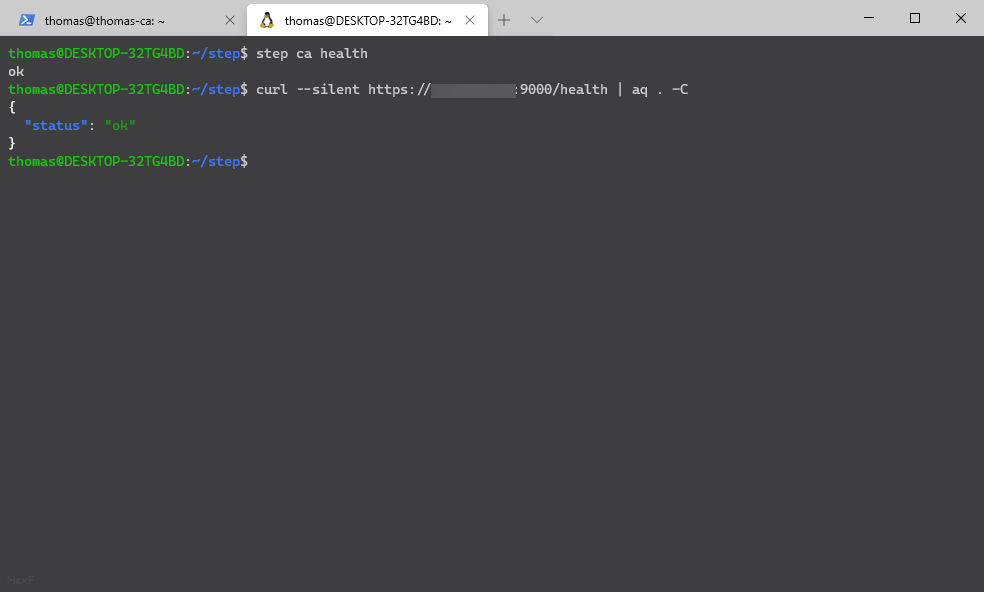

# Setting Clients Up with your Certificate Authority

So you installed you CA, but now want to set your clients up to use it.
The good news is its easy. The bad news is its tedious without automation.

{{ supportMe() }}

## Setting your clients up

Do all these steps for every machine you want to have any contact with your CA on.


### Installing Step-CLI

First step will be to install step-cli on everything.
Thankfully step is on the AUR (Arch User Repository) and apt.

If you don't use Arch or Debian, you will have to install it manually.
Don't worry - there is windows support too!

To get started, head to the [releases page](https://github.com/smallstep/cli/releases) and download the tar.gz file for your operating system.

Extract the `tar.gz` file, and copy the binary to your path with the following

```sh
tar -xzvf step_*.tar.gz
chmod +x step*/bin/step
sudo cp step*/bin/step /usr/bin/step
```

Step should now be on your path and ready to run.
Test this with
```sh
step version
```



### Installing our CA Root Certificates

Now that you have step installed, you can install your certificates similar to how you installed it on the CA server.
Except this time you want to run it with your FQDN.

```sh
step ca bootstrap --install --ca-url https://[fqdn]:9000 --fingerprint [fingerprint]
```

On Windows you might get some prompts, click yes on these prompts and you are ready to go.



You can test that it works by typing

```sh
step ca health
```

### Test it

Finally, test it works. We can run 2 tests this time.

```sh
step ca health
curl --silent https://[fqdn]:9000/health
```




## Final Notes

Now you have your client setup, its time to setup your servers.

* [SSH](../ssh/)
* [HTTPS](../https/)
