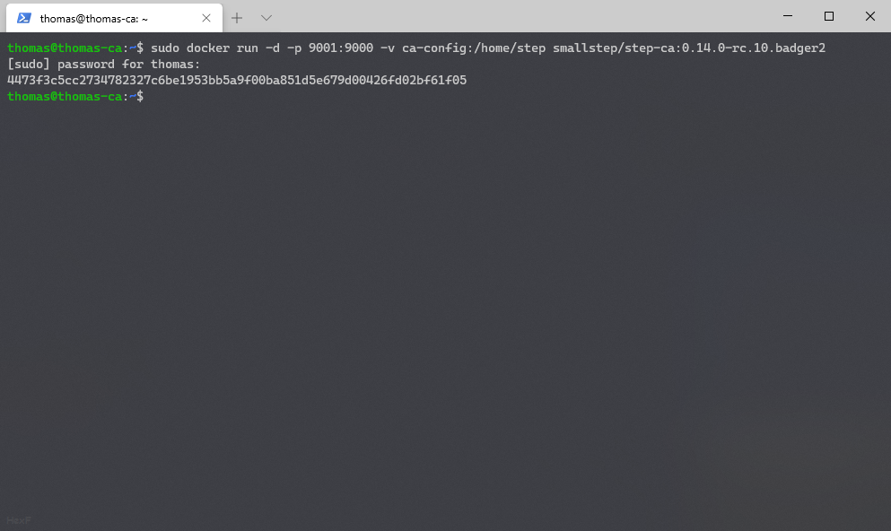

# Setting Up a Certificate Authority

Our platform will run on [`step-ca`](https://github.com/smallstep/certificates) from [smallstep](https://smallstep.com/).

step-ca is a great way to run your own certificate authority, It's easy to setup, but can do some advanced things.

## Prerequisites

* Docker Server running on Something
* Terminal
* Geek-power ⚡

## Method

### Connecting In

Firstly, you want to connect into your machine.
In my case I have dedicated a virtual machine to just running CA duties :smirk:

Here I used an Ubuntu VM, I have already installed docker using `sudo apt-get install docker.io`

!!!note
    I did not use the `snap` package for docker, its acted up before and was not fun to deal with.
    You can try your luck with snap, but I recommend using `docker.io` from apt.


### Docker Image and Volumes

For this we will pull our docker image, and create a volume.

To pull the docker image, run the following

```sh
docker pull smallstep/step-ca:0.14.0-rc.10.badger2
```

!!! note
    Here I used tag `0.14.0-rc.10.badger2`.
    This is because at the time of writing, the `latest` tag is `0.13`, which does not support some features we require.
    Please check the [docker hub](https://hub.docker.com/r/smallstep/step-ca/tags) repository for the latest `0.14.x` build.

!!! note
    You might run into issues stating that you have no permissions connecting to the daemon socket.
    You can either add yourself to the `docker` group, or just `sudo` through it.
    Guess what I picked.


After pulling the image down, we can now create a volume to store our keys and configuration.

```sh
docker volume create ca-config
```


### Initializing step-ca

Now that we have our Docker Volume created and our image pulled, we can start configuring step-ca

Start off by spinning up a docker container, which mounts our volume, and give us a terminal

```sh
docker run -it -v ca-config:/home/step smallstep/step-ca:0.14.0-rc.10.badger2 sh
```

!!! note
    Here use the same tag as the image you pulled before.

This should drop us to a shell inside the container, be patient with it.

From here, run the following command:

```sh
step ca init --ssh
```

This will ask you a few questions.
I recommend you use the following values.

|Question|My Recommended Answer|
|--|--|
|PKI Name|[company/your name]|
|DNS/IP's to add|127.0.0.1,localhost,[fqdn, e.g. ca.hexf.me],[internal ip address]|
|Listen Address|:9000|
|Provisioner Name|provision|
|Password|[blank]|


!!! note
    No, I did not just leak my CA Password, and you shouldn't either.
    The password shown in the image is a password, but not for my production installation.
    This password allows anyone to create a certificate, which could be tied together with your SSH server, allowing an attacker to compromise machines.

    This password is important. Keep it safe.

Now, lets save this password to a file in the volume.

Copy/Paste it into the following command, or type it out if you set your own.

```sh
echo [your password] > /home/step/secrets/password
```

We save the password here so that the CA can decrypt the private keys when it starts up.

!!! note
    Sometimes your password may contain some special characters that bash/sh use (i.e. !).
    To combat this you can either use escape the string by hand, or `vi` the file (I don't blame you if you don't know how to use it)

    In my example, I wrapped the password in single quotes, which was sufficent. Your milage may vary.

    Make sure to check on the password by running `cat /home/step/secrets/password` and make sure they match


Now that our CA has been configured, we can exit by typing

```sh
exit
```

### Starting it up

Now that we have step-ca all setup, we can get it up and running.

To do this, run 1 command:

```sh
docker run -d -p 9000:9000 -v ca-config:/home/step smallstep/step-ca:0.14.0-rc.10.badger2
```

!!! note
    In my example, I use `9001:9000`. This is because this VM already uses port 9000.



### Test its running

Now that our CA is running, we should probably test its online. 

To do so, we can access the `/health` endpoint on the API.

```sh
curl https://localhost:9000/health
```


Wait. What's this? The test failed? - Actually no. It did not fail.
This happened because we don't have our root certificate installed on our machine.

To fix this, we can install it. We will need to know the fingerprint of the root key (scroll up alot!).

Once we know this, run the following command, subsitiuting `[fingerprint]` with the fingerprint copied

```sh
step ca bootstrap --ca-url https://localhost:9001 --fingerprint [fingerprint] --install
curl https://localhost:9000/health
```


That looks better, we are all up and running!

!!! note
    In my example I didn't run the bootstrap command as I didn't want to overwrite my existing certificates on this machines.
    This is also why I switched back to port 9000

## Final Notes

Your now up and running your own CA.

Next up you can learn how to use your CA.

* [Client Installation](../client/)
* [SSH](../ssh/)
* [HTTPS](../https/)